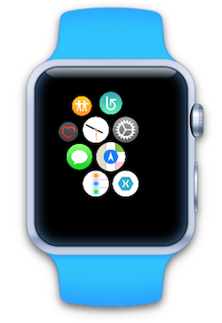

WatchKit Catalog (watchOS 3)
==================================================
MODIFICADO!!

Xamarin watchOS 3 Preview
-------------------------

This sample is for use with the Xamarin watchOS 3 preview that was release along with our [iOS 10 support](https://blog.xamarin.com/let-the-ios10-ing-begin/).

1. Right-click the **WatchApp3** project and select **Set as startup project**.
2. The simulator list should change to display 38mm and 42mm watch options.
3. With a *watch simulator* selected, start debugging.

 

^ Screenshots are shown with the iOS Simulator running inside [Bezel].

Using WatchKit Interface Elements
---------------------------------

WatchKit Catalog is an exploration of the UI elements available in the WatchKit framework.
Throughout the sample, you'll find tips and configurations that will help guide the development of your watchOS app.

### WatchKit Controls

WatchKit Catalog demonstrates how to configure and customize the following controls:

* WKInterfaceController
* WKInterfaceDevice
* WKInterfaceGroup
* WKInterfaceImage
* WKInterfaceLabel
* WKInterfaceMap
* WKInterfaceMovie and WKInterfaceInlineMovie
* WKInterfaceSeparator
* WKInterfaceSlider
* WKInterfaceSwitch
* WKInterfaceTable
* WKInterfaceTimer
* WKUserNotificationInterfaceController
* IWKCrownDelegate and CrownSequencer
* Gesture Recognizers

### Tips

- ButtonDetailController has two examples of how to hide and show UI elements at runtime. First, tapping on button "1" will toggle the hidden property of button "2." When hiding the button, the layout will change to make use of the newly available space. When showing it again, the layout will change to make room for it. The second example is by setting the alpha property of button "2" to 0.0 or 1.0. Tapping on button "3" will toggle this and while button "2" may look invisible, the space it takes up does not change and no layout changes will occur.

- WKInterfaceDevice's screenBounds property is used in ImageDetailController to decide which image resource to load at runtime, depending on the wearer having a 38mm or 42mm Apple Watch. This can be more easily accomplished with images in an Asset Catalog.

- In the storyboard scene for GroupDetailController, note the use of nested groups to achieve more sophisticated layouts of images and labels. This is highly encouraged and will be necessary to achieve specific designs.

- TableDetailController has an example of inserting more rows into a table after the initial set of rows have been added to a table.

- ControllerDetailController shows how to present a modal controller, as well as how to present a controller that does not match the navigation style of your root controller. In this case, the app has a hierarchical navigation style. Using the presentation of a modal controller though, we are able to present a page-based set of controllers.

- ControllerDetailController can present a modal controller. The "Dismiss" text of the modal controller is set in the Title field in the Attributes Inspector of the scene for PageController.

- TextInputController presents the text input controller with a set of suggestions. The result is sent to the parent iOS application and a confirmation message is sent back to the WatchKit app extension.

Build/Runtime Requirements
--------------------------

* Xcode 8.0 (or newer)
* Xamarin Studio 6.10 or newer
* Xamarin.iOS 10

### Copyright

Xamarin port changes are released under the MIT license

### Author

Ported to Xamarin.iOS by Vincent Dondain.

### Other Credits

*Watch screenshots use [Bezel] courtesy of [infinitapps] :)*

[Bezel]:http://infinitapps.com/bezel/
[infinitapps]:http://infinitapps.com/
